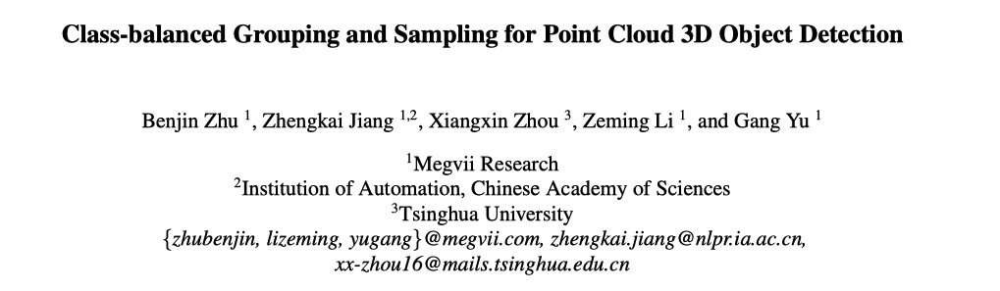
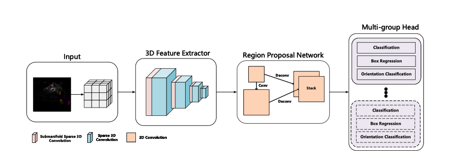

# Class-balanced Grouping and Sampling for Point Cloud 3D Object Detection
This repository contains  the Winner's Code and Technical Report of the nuScenes 3D Object Detection challenge in WAD, CVPR 2019.

Code will be made public before the CVPR 2020 submission deadline.

## Technical Report





[ArXiv](https://arxiv.org/abs/1908.09492)


## Results

### Final Submission compared to PointPillars baseline.

|              | Modality | Map Data | External Data | mAP  | mATE  | mASE  | mAOE  | mAVE  | mAAE  | NDS  |
| ------------ | -------- | -------- | ------------- | ---- | ----- | ----- | ----- | ----- | ----- | ---- |
| PointPillars | LiDAR    | No       | No            | 30.5 | 0.517 | 0.290 | 0.500 | 0.316 | 0.368 | 45.3 |
| Ours         | LiDAR    | No       | No            | 52.8 | 0.300 | 0.247 | 0.380 | 0.245 | 0.140 | 63.3 |

More details of the challenge can be found at [nuScenes Detection Leaderboard](https://www.nuscenes.org/object-detection?externalData=all&mapData=all&modalities=Any).

### Trained Models

* Model Checkpoint: [LINK](https://drive.google.com/open?id=11RmTy6fCgD8soXUcLr2zHaRe6aV4yCuI)
* Detection Results Of [Train](https://drive.google.com/open?id=1SIVtKeGw_rVBZgJ4vSuQ4gSSqbdevYvD)/[Val](https://drive.google.com/open?id=1Zb1jPYzRY4_7oW7PgII6i673RLrdgZx2)/[Test](https://drive.google.com/open?id=1QbseUsG5w0AJtMRxPvD2Pa2BsB2OS3Y2) Split.

The provided checkpoint is a single model with 51.91% mAP and 62.83% NDS. Its input grid size is (0.05m, 0.05m, 0.2m). The cell below shows result details on Val Split.

```
mAP: 0.5191
mATE: 0.3212
mASE: 0.2563
mAOE: 0.3092
mAVE: 0.2281
mAAE: 0.1980
NDS: 0.6283
Eval time: 128.4s
2019-08-20 15:26:32,578 Training INFO: Evaluation nusc: Nusc v1.0-trainval Evaluation
car Nusc dist AP@0.5, 1.0, 2.0, 4.0
72.88, 82.54, 85.90, 87.73 mean AP: 0.8227
truck Nusc dist AP@0.5, 1.0, 2.0, 4.0
30.76, 51.07, 59.57, 63.75 mean AP: 0.5129
construction_vehicle Nusc dist AP@0.5, 1.0, 2.0, 4.0
0.69, 6.33, 16.17, 22.54 mean AP: 0.11433
bus Nusc dist AP@0.5, 1.0, 2.0, 4.0
34.91, 58.73, 73.58, 77.44 mean AP: 0.61163
trailer Nusc dist AP@0.5, 1.0, 2.0, 4.0
1.33, 20.37, 40.35, 48.42 mean AP: 0.2762
barrier Nusc dist AP@0.5, 1.0, 2.0, 4.0
53.17, 64.34, 68.63, 70.98 mean AP: 0.6428
motorcycle Nusc dist AP@0.5, 1.0, 2.0, 4.0
45.94, 51.22, 52.41, 52.74 mean AP: 0.5058
bicycle Nusc dist AP@0.5, 1.0, 2.0, 4.0
25.26, 26.18, 26.25, 26.49 mean AP: 0.2605
pedestrian Nusc dist AP@0.5, 1.0, 2.0, 4.0
78.78, 80.25, 81.91, 83.65 mean AP: 0.8115
traffic_cone Nusc dist AP@0.5, 1.0, 2.0, 4.0
59.83, 61.38, 63.94, 67.85 mean AP: 0.6325
```

## Dependencies
This repo is based on [Det3D](https://github.com/poodarchu/det3d)


## Citation

If you find this work useful in your research, please consider cite:

```
@ARTICLE{2019arXiv190809492Z,
       author = {{Zhu}, Benjin and {Jiang}, Zhengkai and {Zhou}, Xiangxin and
         {Li}, Zeming and {Yu}, Gang},
        title = "{Class-balanced Grouping and Sampling for Point Cloud 3D Object Detection}",
      journal = {arXiv e-prints},
     keywords = {Computer Science - Computer Vision and Pattern Recognition},
         year = "2019",
        month = "Aug",
          eid = {arXiv:1908.09492},
        pages = {arXiv:1908.09492},
archivePrefix = {arXiv},
       eprint = {1908.09492},
 primaryClass = {cs.CV},
       adsurl = {https://ui.adsabs.harvard.edu/abs/2019arXiv190809492Z},
      adsnote = {Provided by the SAO/NASA Astrophysics Data System}
}
```

